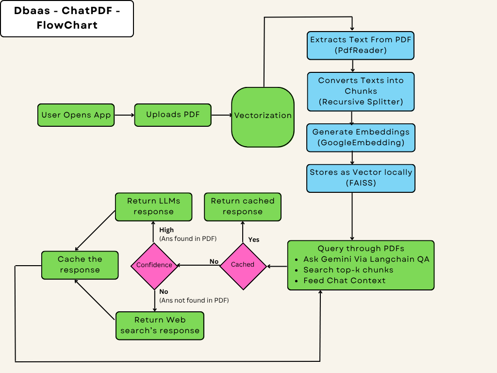
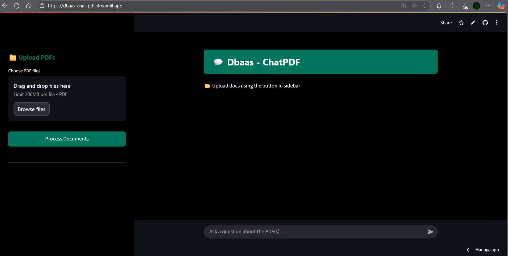
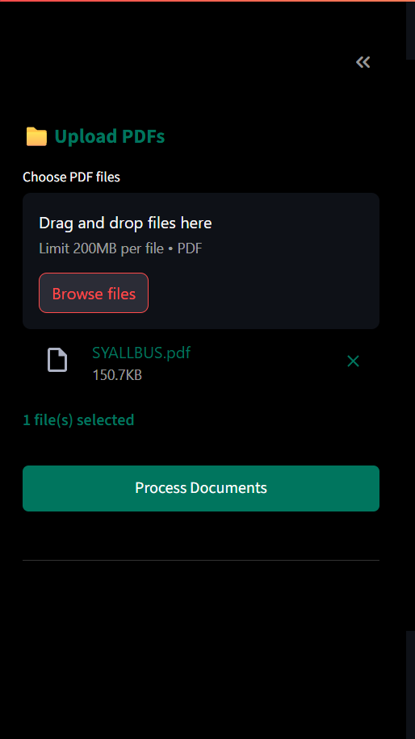
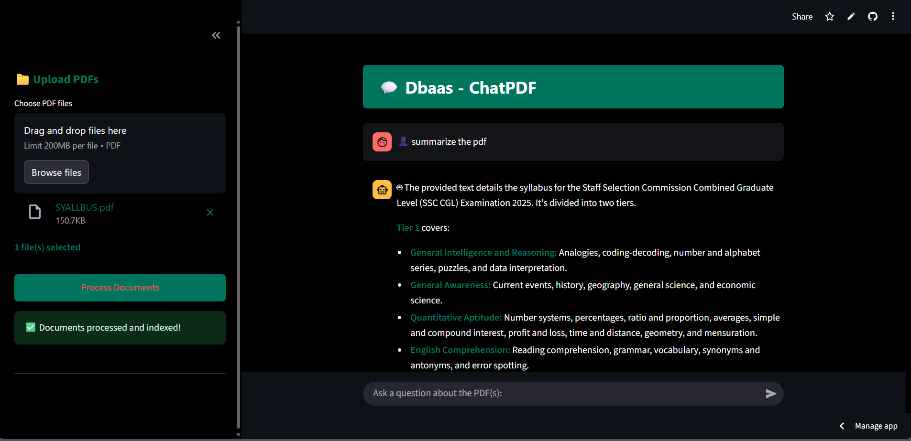
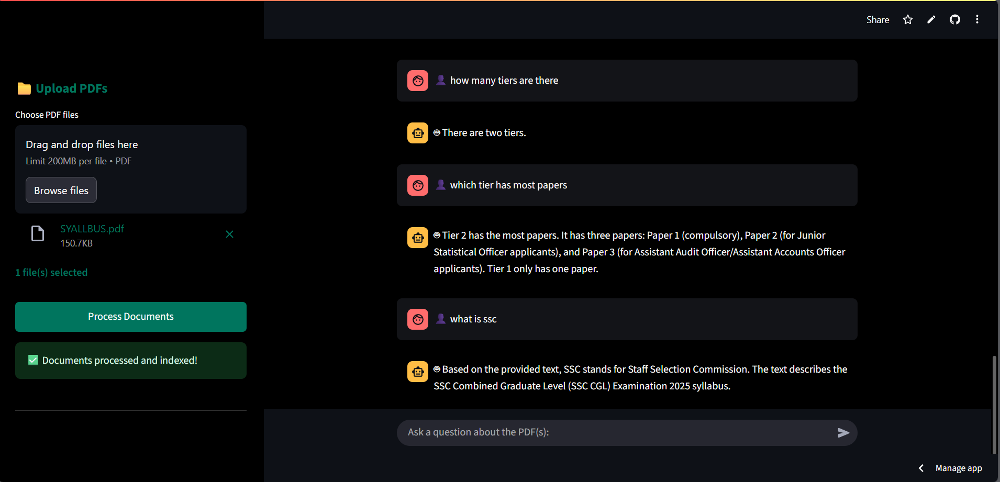
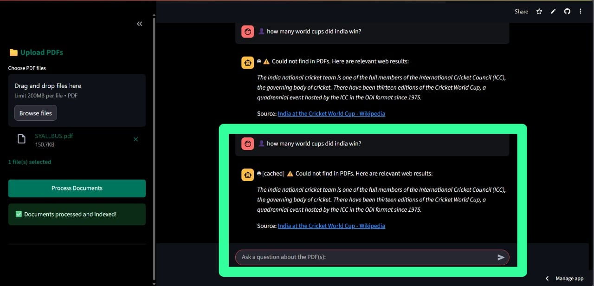
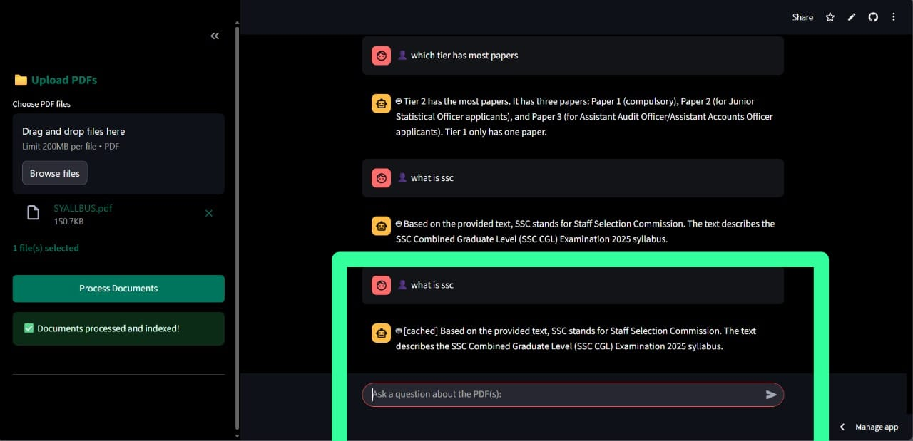

# 📄 PDF Analyzer with Gemini 🔍🤖

A powerful, context-aware PDF question-answering app built using **Streamlit**, **LangChain**, **FAISS**, and **Google Gemini Pro** via `langchain-google-genai`. Upload any PDF, ask questions, and get accurate answers based on the document's actual content.

**APP LINK** - https://balamurugan16sas-chatpdfs.streamlit.app/ - Deployed with streamlit cloud

---

## Directory Structure
```
  root
  |_.devcontainer
  |_env
  |_app.py
  |_.env
  |_requirement.txt
```

---

## Demo Video

https://drive.google.com/file/d/17nf1s8ljWITj304VAytsIYH42l7L4I_e/view

---

## Flow Diagram



---

## 🚀 Features

- 🧠 **LLM-Powered Q&A**: Uses Gemini Pro to answer questions with awareness of the document's context.
- 📚 **Semantic Search**: Retrieves relevant document chunks using vector search via FAISS.
- 💬 **Context Awareness**: Ask follow-up questions with context persistence.
- 🔍 **Top-K Contextual Retrieval**: Retrieve top `k=10` most relevant text chunks per query.
- 🧮 **DuckDuckGo Web Search Fallback**: If query's answer not found, it fallbacks to web search by default.
- ⚙️ **Streamlit Frontend**: Lightweight and fast interface for interacting with your documents.
- 🗂️ **Multi-PDF Ready** (Optional): Can be extended to handle multiple documents or history.
  
---

## 🧩 Tech Stack

- **Frontend**: Streamlit
- **Backend**: Python, LangChain
- **LLM**: Google Gemini Pro via `langchain-google-genai`
- **Embeddings**: Google Generative AI Embeddings
- **Vector Store**: FAISS
- **PDF Processing**: PyPDF2
- **Others**: dotenv, DuckDuckGo Search (optional)

---

## ⚙️ Setup Instructions
  - Clone the repository (git clone)
  - Create a virtual environment (python -m venv name)
  - Install dependencies (pip install -r "requirements.txt")
  - Create .env file with your GOOGLE_API_KEY
  - Run the app (streamlit run app.py)

---

## 🔍 How It Works
  - PDF is uploaded and parsed using PyPDF2.
  - Text is chunked using RecursiveCharacterTextSplitter.
  - Embeddings are generated using GoogleGenerativeAIEmbeddings.
  - Chunks are stored in a FAISS vector store.
  - On user query:
    - Top k=10 similar chunks are retrieved.
    - These are passed into a LangChain QA chain powered by Gemini Pro.
    - Based on confidence of answer (answer being found within pdf or not), response is generated from PDF (RAG - if found), or generated from WebSearch (DuckDuckGo - if not found).
    - Answer is streamed in a chat interface with history, if Query is not previously cached, else streams cached response.
    - New queries are cached with responses.
    - 
---

## ✅ Sample Use-Cases
  - 📑 Legal/contract document analysis
  - 🎓 Academic research document Q&A
  - 📊 Business reports and whitepapers
  - 🤝 Product manuals or onboarding docs
  - ✨ Books and Documents

---

## 📸	Screenshots

### 1. Home Page


### 2. Sidebar to upload PDFs


### 3. Indexing, Vectorization and Auto Summarization


### 4. Context Aware Q&A


### 5. Searching web for Irrelevant queries


### 6. Returning Cached Query's Response

